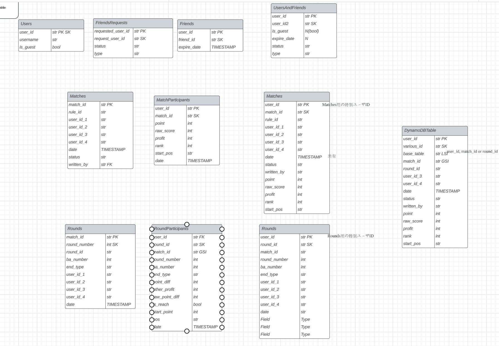

# DBについて

## 背景

元々RDSでやろうとしたが、金が面倒だなと思ってdynamoにした。元々RDBのテーブルだったがおそらく単一テーブルでいける気分になれたので、統合した。

## schema?

[参照](https://lucid.app/lucidchart/95de4622-68c6-4b17-9753-e70720ba22e6/edit?page=0_0&invitationId=inv_00ce94c5-9863-41e0-826f-0301c7c3873b#)

一番右が統合された最終的なテーブル。右から2行目が中間的に統合したもの。そのほかがRDBとして設計したもの

## attributes

ひとまず、ポイントだけ。他のattributeはbase_tableごとに説明する

### idについて
諸々の理由で、各種IDを区別するため、各種IDにsurfixをつける。以下の対応

- user_id: 0xxxxx
- match_id: 1xxxxx
- round_id: 2xxxxx
- rule_id: 3xxxxx

### user_id (PK)
基本は、cognitoのuser_idに先頭に0をつけたもの。必須

検索のため、以下のIDは予約

- 01: match_id の検索用特殊ID
- 02: round_id の検索用特殊ID
- 03: rule_id の検索用特殊ID

### various_id (SK)

user_id, match_id, round_id, rule_idが入る.

### base_table (LSI)

統合前のどのRDBのテーブルのものかを指定。

- 0: Users
- 1: FriendsRequests
- 2: Friends
- 3: Matches
- 4: MatchParticipants
- 5: Rounds
- 6: RoundParticipants
- 7: Rules

### match_id (GSI)

後述の検索用にGSI

### date

LSIになってないけどいいのか?

## apiでの叩き方

こんな感じだからいけるべと思ったらしい。

- 対局開始
    - matches, matchParticipantsに足すだけ
- 対局終了
    - matches, matchParticipantsにupdate by match_id
- 対局削除
    - match_idで削除
- round登録
    - OK
- round削除
    - match_idで検索→user_id1,2,3,4取得→round_numberで削除
- 対局再開
    - user_id, match_idで検索
- 戦績取得(個人)
    - user_idで検索→処理
- 収支計算
    - MatchParticipantsでuser_idで検索, timestampでfilter→(matchesでmatch_idで検索→filterつくる)→filter

## base_table0: Users
|attribute|type|discription|
|----|----|----|
|user_id|S(PK)|user_id|
|various_id|S(SK)|user_id|
|base_table|S|"0"|
|date|S|"YYYY-MM-DDTHH:MM:SS"の形式|
|is_guest|bool||
|device_token|S|optional, 通知用|

## base_table1: FriendsRequests
|attribute|type|discription|
|----|----|----|
|user_id|S(PK)|リクエストを受けた側のuser_id|
|various_id|S(SK)|リクエストをした側のuser_id|
|base_table|S|"1"|
|date|S|"YYYY-MM-DDTHH:MM:SS"の形式|
|status|S|"pending"/"denied"|

## base_table2: Friends
|attribute|type|discription|
|----|----|----|
|user_id|S(PK)|user_id|
|various_id|S(SK)|フレンドのuser_id|
|base_table|S|"2"|
|date|S|"YYYY-MM-DDTHH:MM:SS"の形式|
|expire_date|S|"YYYY-MM-DDTHH:MM:SS"の形式でフレンド関係の有効期限|
|status|S|"accepted"/"temporarily_accepted"|

## base_table3: Matches
match開始時に書いて、終了時にupdateする

|attribute|type|discription|
|----|----|----|
|user_id|S(PK)|"01"|
|various_id|S(SK)|match_id|
|match_id|S(GSI)|match_id|
|base_table|S|"3"|
|date|S|"YYYY-MM-DDTHH:MM:SS"の形式|
|status|S|"playing"/"finished"|
|user_id1|S|参加者(東)のuser_id|
|user_id2|S|参加者(南)のuser_id|
|user_id3|S|参加者(西)のuser_id|
|user_id4|S|参加者(北)のuser_id (サンマの場合はoptional)|
|rule_id|S|rule_id|
|writer_user_id|S|user_id|

## base_table4: MatchParticipants
match終了時に書かれる

|attribute|type|discription|
|----|----|----|
|user_id|S(PK)|user_id|
|various_id|S(SK)|match_id|
|match_id|S(GSI)|match_id|
|base_table|S|"4"|
|date|S|"YYYY-MM-DDTHH:MM:SS"の形式|
|point|N|順位点込みのスコア。0基準。|
|raw_point|N|素点|
|total_profit|N|全体の金額の+-|
|point_profit|N|順位点までのみ含んだ金額の+-|
|bonus_profit|N|飛び、ご祝儀等による金額の+-|
|rank|N|順位|
|start_pos|S|"東"/"南"/"西"/"北"|
|rule_id|S|rule_id|
|writer_user_id|S|user_id|

## base_table5: Rounds

|attribute|type|discription|
|----|----|----|
|user_id|S(PK)|"02"|
|various_id|S(SK)|round_id|
|match_id|S(GSI)|match_id|
|base_table|S|"5"|
|date|S|"YYYY-MM-DDTHH:MM:SS"の形式|
|round_number|N|何局目か0-indexed|
|ba|S|"東1"/"東2"...|
|end_type|S|"和了"/"流局"|
|user_id1|S|参加者(東)のuser_id|
|user_id2|S|参加者(南)のuser_id|
|user_id3|S|参加者(西)のuser_id|
|user_id4|S|参加者(北)のuser_id (サンマの場合はoptional)|
|rule_id|S|rule_id|
|writer_user_id|S|user_id|

## base_table6: RoundParticipants

|attribute|type|discription|
|----|----|----|
|user_id|S(PK)|user_id|
|various_id|S(SK)|round_id|
|match_id|S(GSI)|match_id|
|base_table|S|"6"|
|date|S|"YYYY-MM-DDTHH:MM:SS"の形式|
|end_type|S|"和了"/"流局"|
|user_end_type|S|そのuser目線でのend_type, "ロン"/"ツモ"/"放銃"/"他家ツモ"/"他家ロン"/"流局"|
|is_reach|bool|リーチした|
|start_point|N|開始時の点数|
|end_point|N|終了時の点数|
|point_diff|N|totalの点数変動|
|raw_point_diff|N|上がりによる点数変動|
|other_point_diff|N|リー棒, ノーテン罰符, 本場の点数変動|
|other_profit|N|飛び、ご祝儀等による金額の+-|
|start_rank|N|開始時順位|
|end_rank|N|開始時順位|
|pos|S|"東"/"南"/"西"/"北"|
|rule_id|S|rule_id|
|writer_user_id|S|user_id|

## base_table7: Rules

|attribute|type|discription|
|----|----|----|
|user_id|S(PK)|"03"|
|various_id|S(SK)|rule_id|
|base_table|S|"7"|
|date|S|"YYYY-MM-DDTHH:MM:SS"の形式|
|rule_name|S||
|n_persons|N|3/4|
|n_rounds|N|4/8/12/16|
|start_point|N|開始時点数|
|end_point|N|終了時点数(x点返し、1位総取り)|
|rank_point_1|N|1位の順位点|
|rank_point_2|N|2位の順位点|
|rank_point_3|N|3位の順位点|
|rank_point_4|N|4位の順位点|
|rate|N|100点あたりのレート|
|tobishou|N|飛び賞、順位点換算で|
||||

以下は対応しない

- チップ: 赤, 一発とか入力をする必要があるので面倒なので方針としてやらない
- ご祝儀: (実装めんどくさい)
